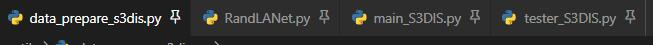

# TODOs

- adapt this repo to SQN network

# explore

## run the code (for S3DIS dataset) ?

- Clone the repository

```
git clone --depth=1 https://github.com/PointCloudYC/RandLA-Net && cd RandLA-Net
```

- Setup python environment; here I use my `DL` conda env.

official way:
```
conda create -n randlanet python=3.5
source activate randlanet
pip install -r helper_requirements.txt
sh compile_op.sh
```

- Download S3DIS and make soft link to the current repo's local data folder

```
# S3DIS is already downloaded at /media/yinchao/Mastery/dataset/S3DIS2
ln -s /media/yinchao/Mastery/dataset/S3DIS2 ./data/S3DIS/Stanford3dDataset_v1.2_Aligned_Version   
```

- Preprocess the raw dataset

```
# prepare the dataset, each room will have resulted in four files(1 file in the original_ply folder for raw_pc.ply, and 3 files in the input_0.040 for sub_pc.py, sub_pc.kdtree, and project_indices file for each raw point), check data_prepare_s3dis.py for details.
python utils/data_prepare_s3dis.py

# check #rooms in npy format, should be 272 rooms
find *.npy | wc -l
```

- train on s3dis

```
python -B main_S3DIS.py --gpu 0 --mode train --test_area 5
python -B main_S3DIS.py --gpu 0 --mode test --test_area 5
# for cross validation, use the script
# sh jobs_6_fold_cv_s3dis.sh

# Move all the generated results (*.ply) in /test folder to /data/S3DIS/results, calculate the final mean IoU results:
python utils/6_fold_cv.py
```


## code structure

**key files are in bold**



```
--imgs, the author's gif figures
--images, my experimental images, e.g. confusion matrix pictures
--data, dataset folder where MEPNet, S3DIS, Semantic3D and SemanticKITTI are placed.
--utils
  --cpp_wrappers, cpp_subsampling and utility code

  --nearest_neighbors, KDTree nearest search c++ code.

  --**meta**, for semantic segmentation, including 1)anno_paths.txt describing paths of training and testing point cloud files, 2)class_names.txt for all included classes

  --data_prepare_{mepnet,s3dis,semantic3d,semantickitti}.py, prepare training files for the raw dataset.
  --6_fold_cv.py, synthesize metrics(accuracy, mIoU) from result folder for S3DIS dataset

--helper_ply.py, ply relevant functions, e.g., write, read.
--helper_tf_util.py, tf utility functions
--helper_tool.py, dataset config, plotting and etc.
--helper_requirements.txt

--**RandLANet.py**, the RandLA-Net model; provides key methods for the model, including __init__, inference, dilated_res_block, random_sample, building_block, relative_pos_encoding, att_pooling, nearest_interpolation, conv2d_transpose methods.

--**main_{MEPNet,S3DIS,Semantic3D,SemanticKITTI}.py**, declare the dataset class and train, evaluate, test and visulize data.

--**tester_{MEPNet,S3DIS,Semantic3D,SemanticKITTI}.py**, test code.

--logs, evaluation log (recording metrics for each training and evaluation)

--scripts, scripts

--test, log for testing set
```

## problems
### can not find nearest_neighbors.lib.python.nearest_neighbors module for helper_tool.py

- problem: when run the main file(main_S3DIS.py), report cannot find nearest_neighbors.lib.python.nearest_neighbors module for helper_tool.py

- reason: when executing the `sh compile_op.sh`, the `python setup.py install --home="."` does not execute correctly, which reports ModuleNotFoundError: No module named 'Cython'.
- solution: make sure your current conda env install the Cython module correctly

```
# /usr/bin/python3 -m pip install --upgrade pip
pip3 install --upgrade cython
```

### OOM (out-of-memory) problem

- problem: when run the training program, reports the OOM issue
- solution: reduce your training batch size from 6 to a smaller number, e.g., 2; Or you can training on a GPU w. larger memory.


# exploitation

## replication problems
### borrow pointnet++'s tf_ops
- check the code.

### index out of range error when generating point cloud Examples with a possibility

- solution: DP.aug() --> DP.aug_Sqn()

### can not choose the weak points correctly from the the sub_pc(self.points)

- error: cannot retrieve points correctly, the goal is to obtain weak points (shape like (n,3) and n should be far less than N=40960); Consequently, in the query network, weak points will be like (40960,3), so performing the three_nearest_interpolation would be impossible since it costs too much GPU when the original points (2,40960,3) over the 1st stage points and features (2,40960/4,3+32). A required tensor' shape be like (40960, 40960/4, 32), which is extremely large.

```
# BUG: can not select the masked points ,ending up with (n=all points=40960， 3)-> resulting in OOM when performing interplolation. Avoid using this.
# weakly_points = points[weak_label_masks==1,:] # (n,3), each batch might have different number of weak points
# weakly_points_labels=labels[weak_label_masks==1,:] # (n,)
```

- solution: use tf.boolean_mask or tf.gather_nd

```
# method1 using boolean_mask
# weak_points = tf.boolean_mask(self.points,tf.cast(self.weak_label_masks,tf.bool)) # (n,3), e.g., one batch has 26 weak pts
# weakly_points_labels = tf.boolean_mask(self.labels,tf.cast(self.weak_label_masks,tf.bool)) # (n,)
# method2 using the gather_nd
selected_idx = tf.where(tf.equal(self.weak_label_masks,1)) # (n,2)
weak_points = tf.gather_nd(self.points, selected_idx)
weak_points_labels=tf.gather_nd(self.labels, selected_idx)# (n,)
```

## Ideas implementation
### encoding 

- sympy examples and adaptation of the spherical coordinate system code
- experiment on S3DIS 

### dilated residual blocks

- densenet idea
- resnet family(SENet, ResNeXt, SKNet, ResNeSt)

### SOTA model_selection

- HRNet
- EfficientNet

### encoder-decoder structure

- PSPNet, Unet, deeplabv3+
- Unet++
- ??

### loss functions

- CE, WCE w. inverse frequency, and WCE w. square root frequency.
- focal, lovsaz and dice loss
- experiments